# Architecture Documentation / 아키텍처 문서

## 개요 / Overview

### 일반 사용자를 위한 설명 / For General Users

#### 한국어
Enhanced NASDAQ Stock Screener는 나스닥 상장 주식들을 자동으로 분석하여 투자 가치가 높은 종목을 찾아내는 프로그램입니다. 마치 수천 명의 애널리스트가 동시에 모든 주식을 분석하는 것과 같은 효과를 제공합니다. 이 프로그램은 기업의 재무 상태, 성장성, 리스크, 가치 평가 등을 종합적으로 검토하여 0에서 1 사이의 품질 점수를 계산합니다. 높은 점수일수록 더 좋은 투자 기회를 의미합니다.

#### English
The Enhanced NASDAQ Stock Screener is a program that automatically analyzes NASDAQ-listed stocks to identify those with high investment value. It works like having thousands of analysts simultaneously analyzing all stocks. The program comprehensively evaluates companies' financial health, growth potential, risk levels, and valuations to calculate a quality score between 0 and 1. A higher score indicates a better investment opportunity.

### 프로그래머를 위한 설명 / For Programmers

#### 한국어
이 시스템은 Python 기반의 비동기 주식 스크리닝 애플리케이션으로, Financial Modeling Prep API를 통해 실시간 금융 데이터를 수집하고 분석합니다. asyncio를 활용한 동시성 처리로 수천 개의 주식을 효율적으로 분석하며, 섹터별 상대 평가를 통해 객관적인 투자 지표를 제공합니다. 모듈화된 아키텍처로 설계되어 성장성, 리스크, 가치평가, 시장 심리 분석기가 독립적으로 작동하며, 최종적으로 가중치 기반 품질 점수를 산출합니다.

#### English
This system is a Python-based asynchronous stock screening application that collects and analyzes real-time financial data through the Financial Modeling Prep API. Using asyncio for concurrency, it efficiently analyzes thousands of stocks and provides objective investment metrics through sector-relative evaluation. Designed with a modular architecture, growth, risk, valuation, and sentiment analyzers operate independently, ultimately producing a weighted quality score.

## 시스템 아키텍처 / System Architecture

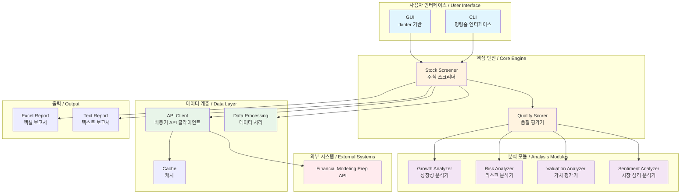

## 데이터 흐름 / Data Flow

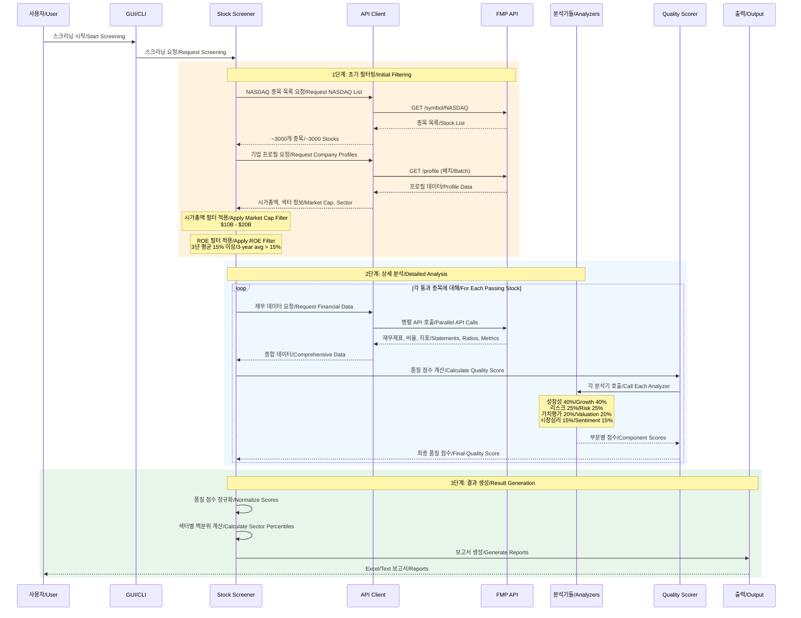

## 스크리닝 기준 상세 / Detailed Screening Criteria

### 초기 필터 / Initial Filters

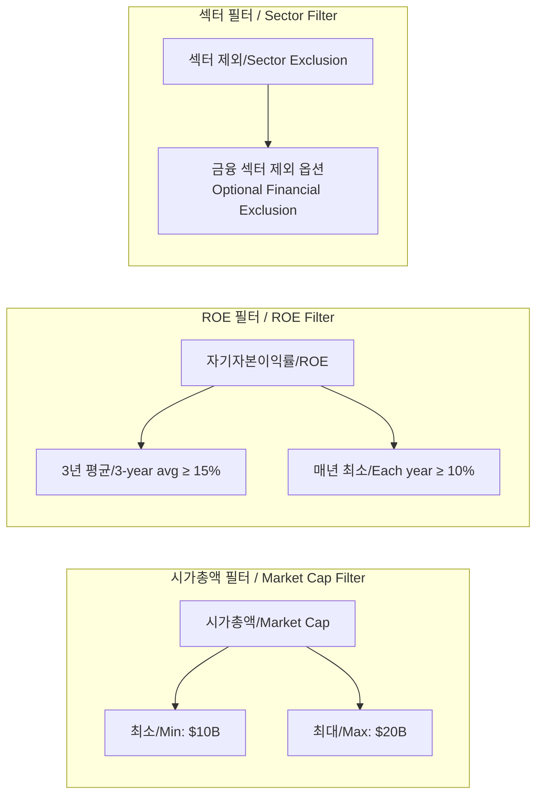

### 성장성 평가 (40% 가중치) / Growth Quality Assessment (40% Weight)

#### 한국어 설명
성장성 평가는 기업의 미래 성장 잠재력을 측정합니다. 매출, 주당순이익(EPS), 잉여현금흐름(FCF)의 연평균 성장률(CAGR)을 계산하고, 성장의 일관성과 지속가능성을 평가합니다.

#### English Explanation
Growth assessment measures a company's future growth potential. It calculates the Compound Annual Growth Rate (CAGR) for revenue, EPS, and FCF, while evaluating growth consistency and sustainability.

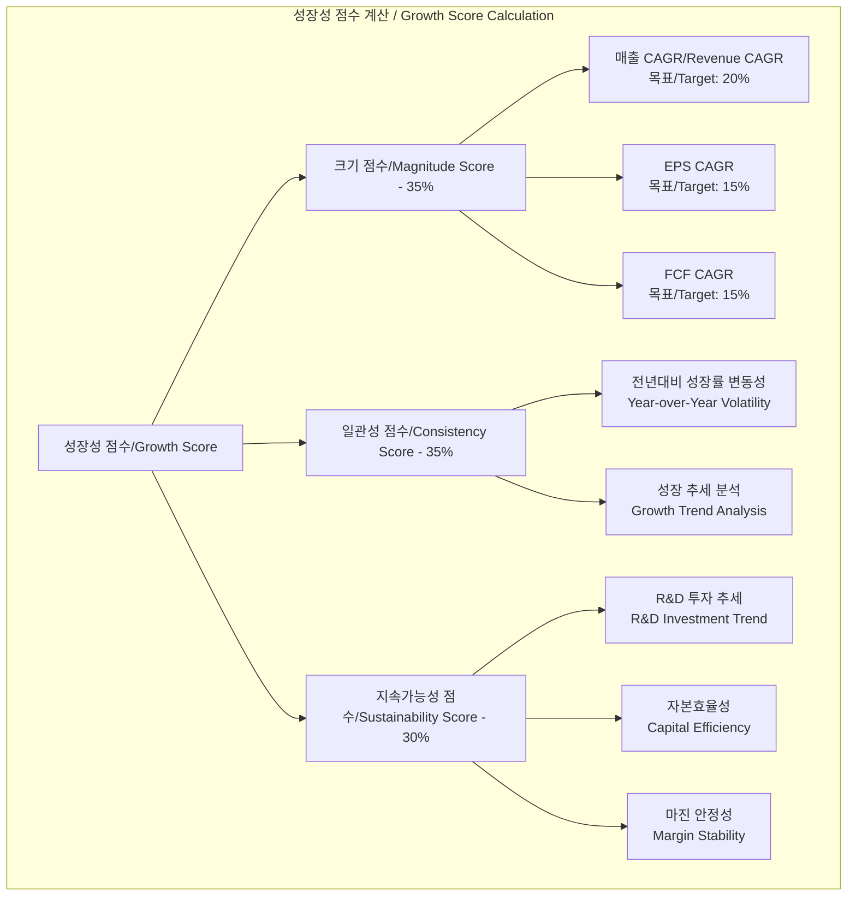

#### 성장성 점수 계산 공식 / Growth Score Formula

```
크기 점수 (Magnitude Score):
- 실제 CAGR ≤ 0: 점수 = 0
- 실제 CAGR ≥ 목표 × 2: 점수 = 1.0
- 그 외: 점수 = 0.5 × (1 + log(실제/목표) / log(2))

일관성 점수 (Consistency Score):
- 변동계수(CV) = 표준편차 / 평균
- 점수 = 1 / (1 + CV)
- 모든 기간 양의 성장 시 +0.2 보너스

최종 성장성 점수 = 0.35 × 크기 + 0.35 × 일관성 + 0.30 × 지속가능성
```

### 리스크 평가 (25% 가중치) / Risk Assessment (25% Weight)

#### 한국어 설명
리스크 평가는 기업의 재무 안정성과 위험 요소를 측정합니다. 부채 수준, 이자보상배율, 운전자본, 현금흐름 품질을 종합적으로 평가합니다.

#### English Explanation
Risk assessment measures a company's financial stability and risk factors. It comprehensively evaluates debt levels, interest coverage, working capital, and cash flow quality.

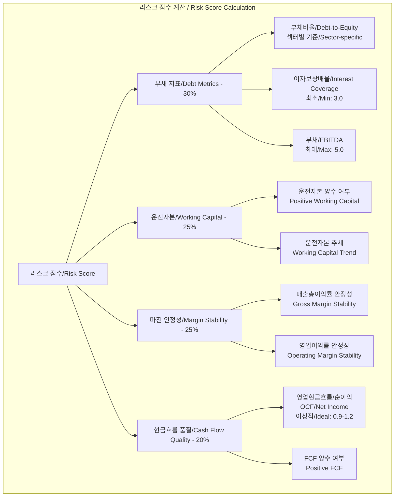

#### 리스크 점수 계산 기준 / Risk Score Calculation Criteria

```
부채 점수 (Debt Score):
- 부채비율 = 0: 점수 = 1.0
- 부채비율 ≥ 섹터 최대: 점수 = 0.0
- 이자보상배율 < 1.5: 점수 = 0.0 (위험)
- 이자보상배율 ≥ 10: 점수 = 1.0 (우수)

현금흐름 품질 (Cash Flow Quality):
- OCF/NI 비율 0.9-1.2: 점수 = 1.0 (이상적)
- OCF/NI 비율 < 0.7: 점수 = 0.3 (수익 품질 의심)
- FCF 3년 연속 양수: 보너스 점수
```

### 가치평가 (20% 가중치) / Valuation (20% Weight)

#### 한국어 설명
가치평가는 현재 주가가 기업의 실제 가치 대비 적정한지 평가합니다. PER, PBR, FCF 수익률, 성장 대비 가치(PEG)를 분석합니다.

#### English Explanation
Valuation assesses whether the current stock price is appropriate relative to the company's actual value. It analyzes P/E ratio, P/B ratio, FCF yield, and PEG ratio.

```mermaid
graph TD
    subgraph "가치평가 점수 / Valuation Score"
        VS[가치평가 점수/Valuation Score]
        
        PER[PER - 30%]
        PBR[PBR - 20%]
        FCFY[FCF 수익률/FCF Yield - 30%]
        PEG[PEG 비율/PEG Ratio - 20%]
        
        VS --> PER
        VS --> PBR
        VS --> FCFY
        VS --> PEG
        
        PER --> PERM[섹터별 최대 PER<br/>Sector Max P/E<br/>기술주/Tech: 30<br/>금융/Financial: 20]
        
        PBR --> PBRM[섹터별 최대 PBR<br/>Sector Max P/B<br/>기술주/Tech: 5.0<br/>금융/Financial: 2.0]
        
        FCFY --> FCFYM[FCF/시가총액<br/>FCF/Market Cap<br/>목표/Target ≥ 4%]
        
        PEG --> PEGM[PER/(성장률×100)<br/>P/E/(Growth×100)<br/>이상적/Ideal < 1.0]
    end
```

### 시장 심리 (15% 가중치) / Market Sentiment (15% Weight)

#### 한국어 설명
시장 심리는 내부자 거래, 실적 서프라이즈, 소셜 미디어 감성을 분석하여 시장의 기업에 대한 인식을 평가합니다.

#### English Explanation
Market sentiment evaluates market perception of the company by analyzing insider trading, earnings surprises, and social media sentiment.

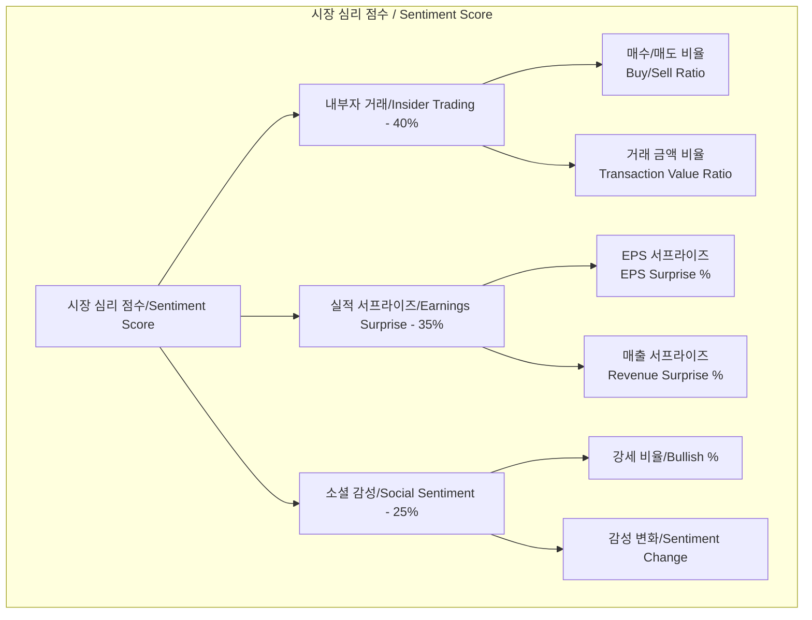

## 품질 점수 계산 알고리즘 / Quality Score Calculation Algorithm

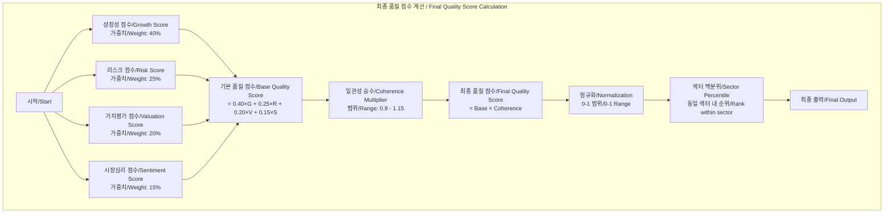

### 일관성 승수 계산 / Coherence Multiplier Calculation

#### 한국어 설명
일관성 승수는 각 평가 요소들이 서로 얼마나 조화를 이루는지 측정합니다. 예를 들어, 높은 성장률과 높은 FCF가 함께 나타나면 더 높은 점수를 받습니다.

#### English Explanation
The coherence multiplier measures how well different evaluation elements harmonize with each other. For example, high growth rate combined with high FCF receives a higher score.

일관성 체크 항목 / Coherence Check Items:
1. 매출 성장과 FCF 성장 일치 / Revenue and FCF growth alignment
2. 마진 안정성과 높은 ROE / Margin stability with high ROE
3. 성장률과 밸류에이션 균형 / Growth and valuation balance
4. 낮은 부채와 강한 현금흐름 / Low debt with strong cash flow
5. 매출과 수익의 일관성 / Revenue and earnings consistency

## 섹터별 벤치마크 / Sector-Specific Benchmarks

### 11개 섹터 기준 / 11 Sector Standards

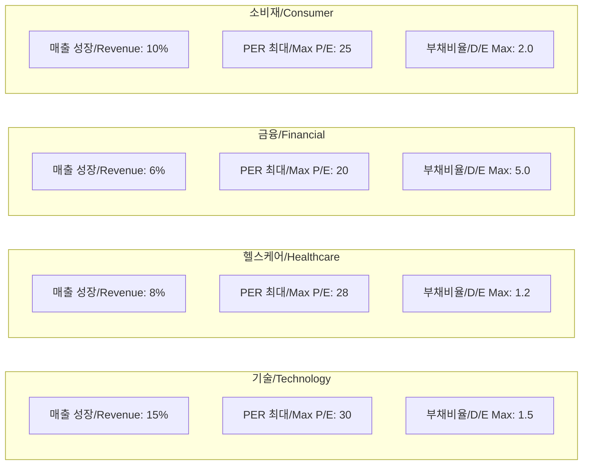

각 섹터별로 다른 기준을 적용하여 공정한 비교가 가능합니다. 예를 들어, 기술주는 높은 성장률이 기대되지만, 유틸리티 섹터는 안정성이 더 중요합니다.

## API 통합 및 속도 제한 / API Integration and Rate Limiting

### API 요청 흐름 / API Request Flow

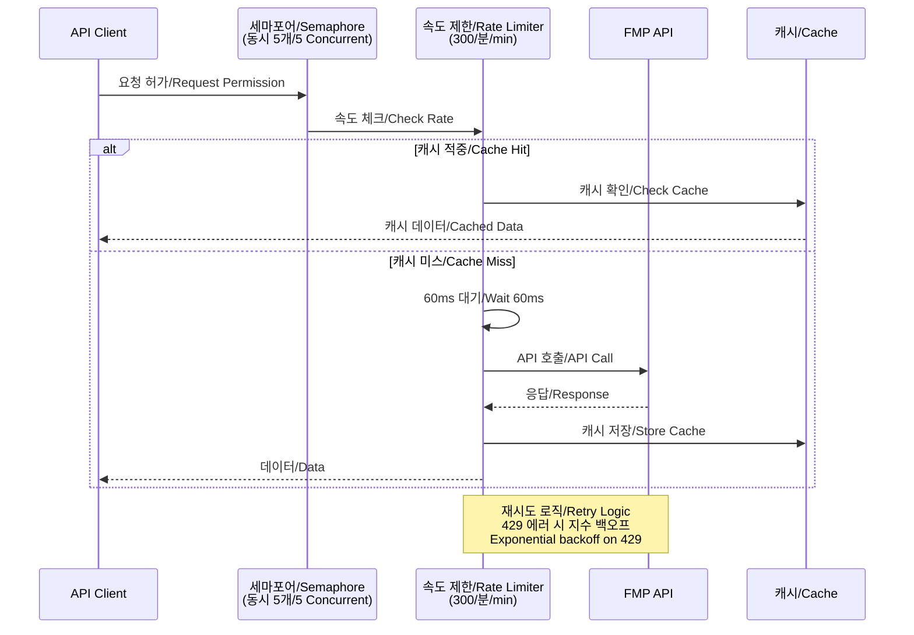

### API 엔드포인트 / API Endpoints

주요 사용 엔드포인트 / Main Endpoints Used:
- `/symbol/NASDAQ` - NASDAQ 종목 목록 / NASDAQ symbol list
- `/profile` - 기업 프로필 (배치 100개) / Company profiles (batch 100)
- `/income-statement` - 손익계산서 / Income statements
- `/cash-flow-statement` - 현금흐름표 / Cash flow statements
- `/balance-sheet-statement` - 재무상태표 / Balance sheets
- `/ratios` - 재무 비율 / Financial ratios
- `/key-metrics` - 핵심 지표 / Key metrics
- `/insider-trading` - 내부자 거래 / Insider trading
- `/social-sentiments` - 소셜 감성 / Social sentiment

## 사용자 인터페이스 / User Interfaces

### GUI 인터페이스 / GUI Interface

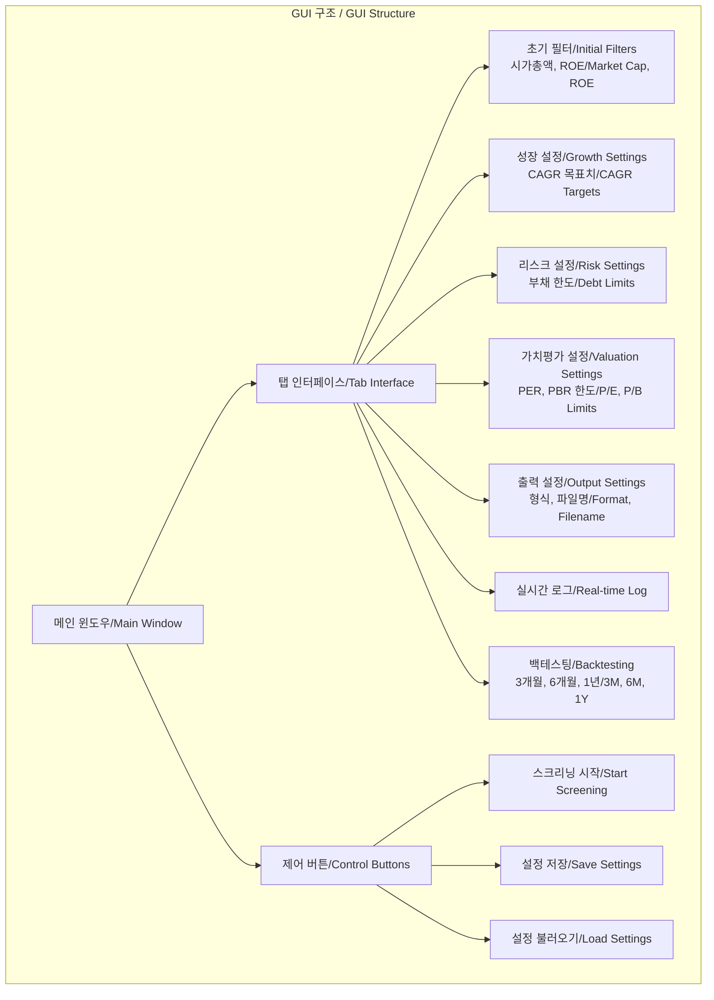

### CLI 인터페이스 / CLI Interface

명령줄 사용법 / Command Line Usage:
```bash
# 기본 실행 / Basic execution
python stock_screener.py

# GUI 실행 / Run GUI
python gui.py

# 백테스팅 실행 / Run backtesting
python backtest.py
```

## 출력 형식 / Output Formats

### Excel 보고서 구조 / Excel Report Structure

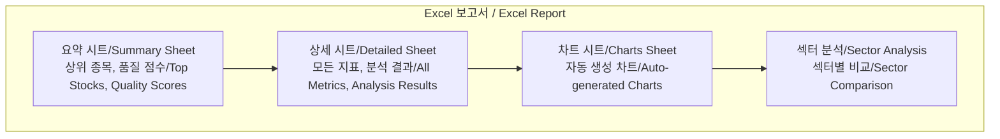

포함되는 차트 / Included Charts:
1. 품질 점수 분포 / Quality Score Distribution
2. 섹터별 성과 / Performance by Sector
3. 성장률 vs 밸류에이션 / Growth vs Valuation
4. 리스크-수익 산점도 / Risk-Return Scatter Plot

## 백테스팅 방법론 / Backtesting Methodology

### 백테스팅 프로세스 / Backtesting Process

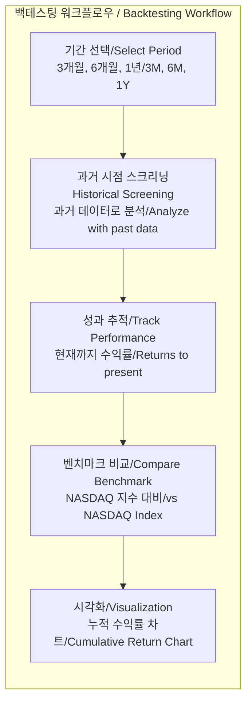

### 백테스팅 결과 해석 / Interpreting Backtest Results

#### 한국어
백테스팅은 과거 특정 시점에 이 스크리너를 사용했다면 어떤 결과를 얻었을지 보여줍니다. 선택된 종목들의 실제 수익률을 NASDAQ 지수와 비교하여 스크리너의 효과를 검증합니다.

#### English
Backtesting shows what results would have been achieved if this screener had been used at a specific point in the past. It validates the screener's effectiveness by comparing the actual returns of selected stocks with the NASDAQ index.

## 설정 옵션 / Configuration Options

### enhanced_config.json 주요 설정 / Key Settings

```json
{
    "초기 필터 / Initial Filters": {
        "market_cap_min": 10000000000,  // $10B
        "market_cap_max": 20000000000,  // $20B
        "roe": {
            "min_avg": 0.15,      // 15% 평균
            "min_each_year": 0.10, // 10% 매년
            "years": 3             // 3년 기준
        }
    },
    
    "점수 가중치 / Score Weights": {
        "growth_quality": 0.40,    // 40%
        "risk_quality": 0.25,      // 25%
        "valuation": 0.20,         // 20%
        "sentiment": 0.15          // 15%
    },
    
    "동시성 설정 / Concurrency": {
        "max_workers": 5,          // 동시 작업 수
        "request_delay": 0.06,     // 60ms 지연
        "max_retries": 3           // 최대 재시도
    }
}
```

## 성능 최적화 / Performance Optimization

### 최적화 기법 / Optimization Techniques

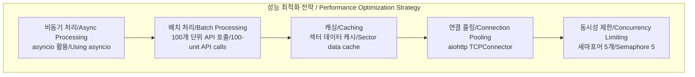

### 처리 시간 / Processing Time

일반적인 처리 시간 / Typical Processing Times:
- 초기 필터링: ~5초 / Initial filtering: ~5 seconds
- 상세 분석 (100개 종목): ~60초 / Detailed analysis (100 stocks): ~60 seconds
- 보고서 생성: ~5초 / Report generation: ~5 seconds
- 전체 프로세스: ~70-90초 / Total process: ~70-90 seconds

## 확장 가능성 / Scalability and Extensibility

### 향후 개선 방향 / Future Improvements

#### 한국어
1. **머신러닝 통합**: 과거 데이터를 학습하여 예측 정확도 향상
2. **실시간 모니터링**: 선택된 종목의 실시간 추적 및 알림
3. **포트폴리오 최적화**: 현대 포트폴리오 이론 적용
4. **글로벌 시장 확장**: NASDAQ 외 다른 거래소 지원
5. **사용자 맞춤 전략**: 개인 투자 성향에 따른 맞춤 분석

#### English
1. **Machine Learning Integration**: Improve prediction accuracy by learning from historical data
2. **Real-time Monitoring**: Real-time tracking and alerts for selected stocks
3. **Portfolio Optimization**: Apply Modern Portfolio Theory
4. **Global Market Expansion**: Support exchanges beyond NASDAQ
5. **Custom User Strategies**: Personalized analysis based on investment preferences

## 보안 고려사항 / Security Considerations

### API 키 관리 / API Key Management

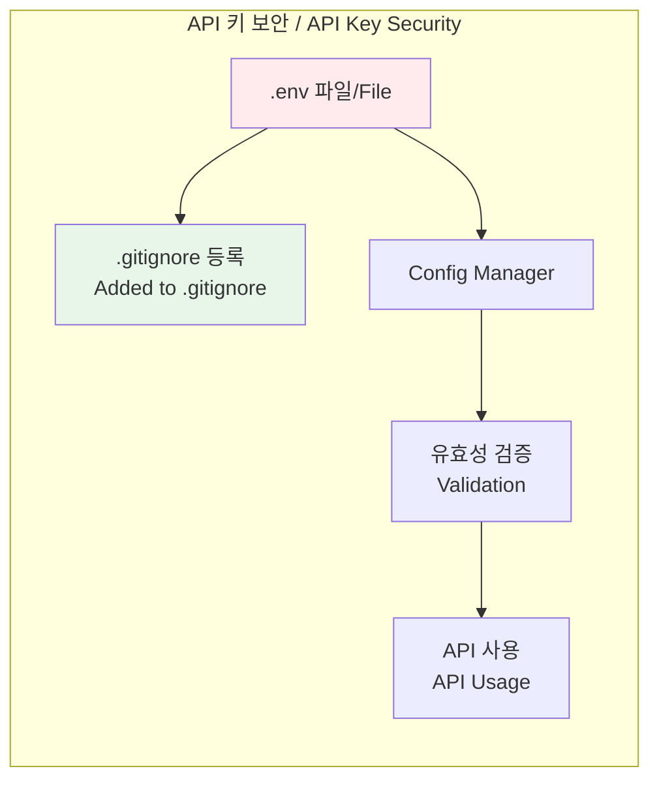

보안 모범 사례 / Security Best Practices:
1. API 키를 코드에 하드코딩하지 않음 / Never hardcode API keys
2. .env 파일 사용 및 버전 관리 제외 / Use .env file and exclude from version control
3. 환경 변수를 통한 키 관리 / Manage keys through environment variables
4. 정기적인 키 교체 / Regular key rotation

## 용어 사전 / Glossary

### 재무 용어 / Financial Terms

| 한국어 | English | 설명 / Description |
|--------|---------|-------------------|
| 시가총액 | Market Cap | 발행 주식 수 × 현재 주가 / Shares × Current Price |
| ROE | Return on Equity | 순이익 ÷ 자기자본 / Net Income ÷ Equity |
| PER | P/E Ratio | 주가 ÷ 주당순이익 / Price ÷ EPS |
| PBR | P/B Ratio | 주가 ÷ 주당순자산 / Price ÷ Book Value |
| FCF | Free Cash Flow | 영업현금흐름 - 자본지출 / Operating CF - CapEx |
| CAGR | Compound Annual Growth Rate | 연평균 성장률 / Annual Growth Rate |
| EBITDA | Earnings Before Interest, Taxes, Depreciation, and Amortization | 이자, 세금, 감가상각 전 이익 |

## 결론 / Conclusion

### 한국어
Enhanced NASDAQ Stock Screener는 복잡한 금융 분석을 자동화하여 개인 투자자도 전문가 수준의 종목 분석을 수행할 수 있게 합니다. 섹터별 상대 평가, 다차원 품질 점수, 백테스팅 기능을 통해 객관적이고 검증 가능한 투자 의사결정을 지원합니다.

### English
The Enhanced NASDAQ Stock Screener automates complex financial analysis, enabling individual investors to perform professional-level stock analysis. Through sector-relative evaluation, multi-dimensional quality scoring, and backtesting capabilities, it supports objective and verifiable investment decision-making.

---

*이 문서는 Enhanced NASDAQ Stock Screener v1.0의 아키텍처를 설명합니다.*
*This document describes the architecture of Enhanced NASDAQ Stock Screener v1.0.*